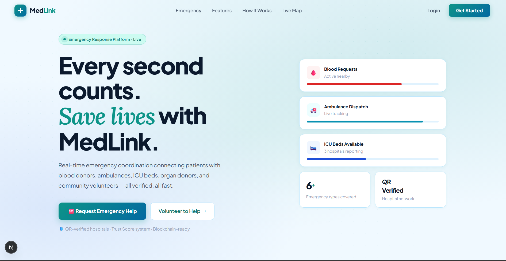
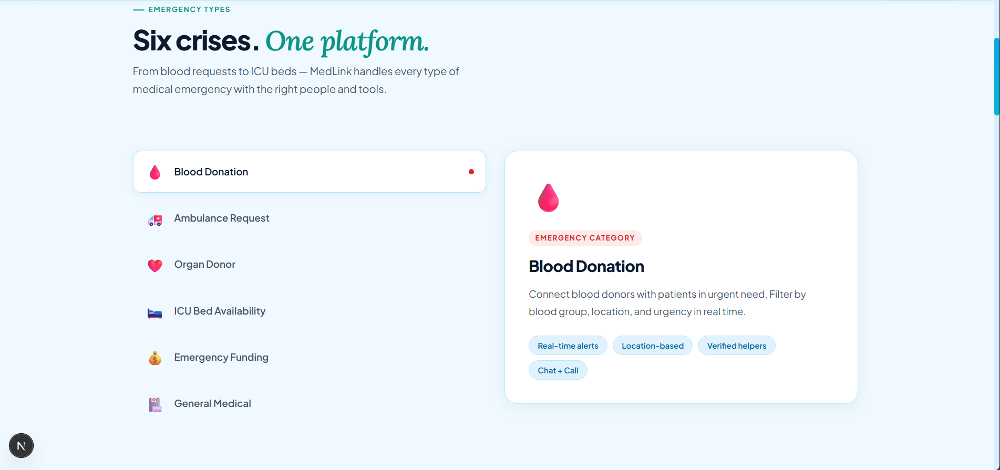
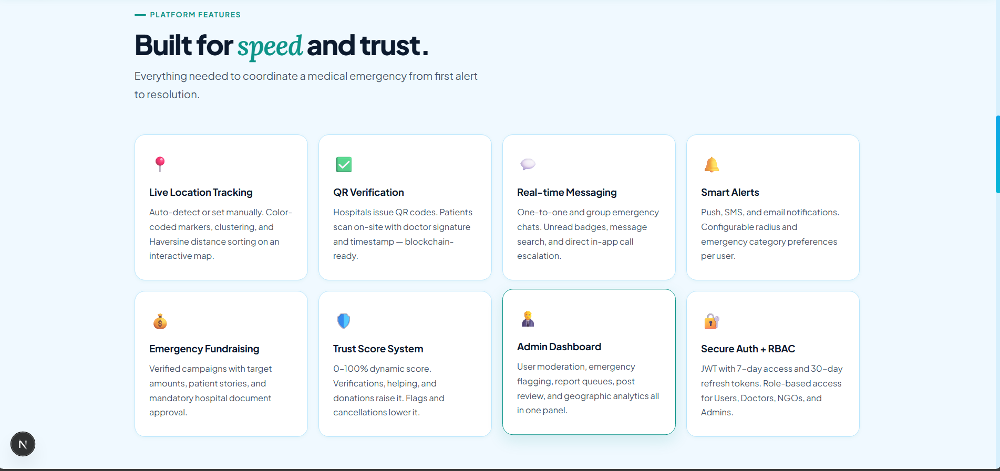
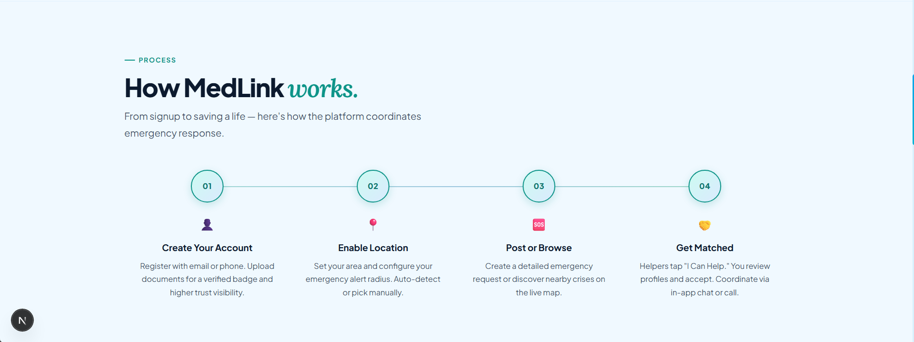
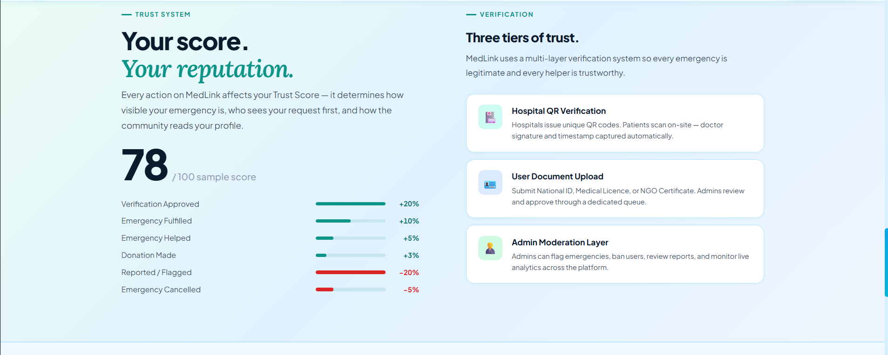
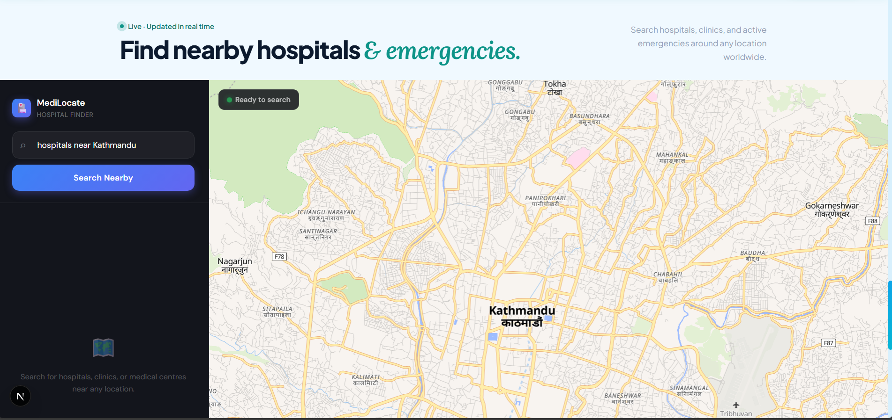
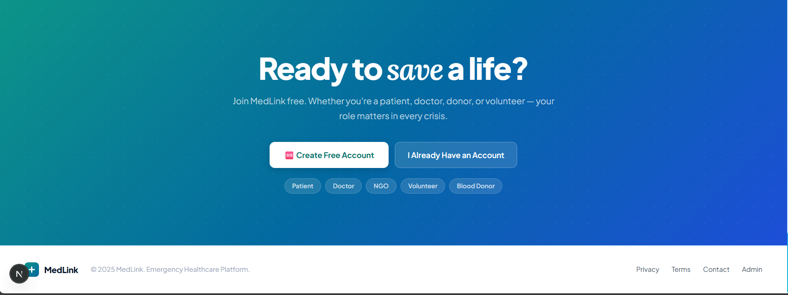
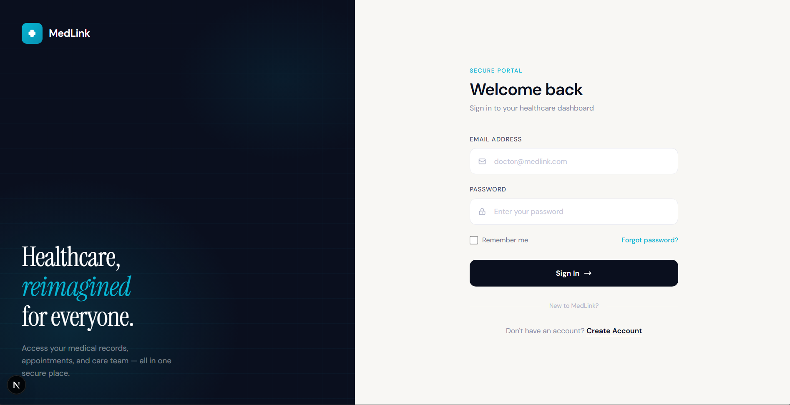

<div align="center">

<br/>



<br/>
<br/>

# 🏥 MedLink

### Real-time Emergency Healthcare Coordination Platform

<p align="center">
  Connecting patients with blood donors, ambulances, ICU beds, organ donors,<br/>
  and verified community volunteers — all in real time.
</p>

<br/>

[](https://nextjs.org/)
[](https://www.typescriptlang.org/)
[](https://nodejs.org/)
[](https://mongodb.com/)
[](https://socket.io/)
[](https://tailwindcss.com/)

<br/>

[](https://github.com/yourusername/medlink/pulls)
[](https://github.com/yourusername/medlink/issues)
[](https://github.com/yourusername/medlink/stargazers)
[](https://github.com/yourusername/medlink/commits)

</div>

---

## 📌 Table of Contents

- [About](#-about)
- [Screenshots](#-screenshots)
- [Features](#-features)
- [Tech Stack](#-tech-stack)
- [Getting Started](#-getting-started)
- [Environment Variables](#-environment-variables)
- [User Roles](#-user-roles)
- [Contributing](#-contributing)
- [Contact](#-contact)

---

## 🩺 About

**MedLink** is a full-stack emergency healthcare coordination platform built to bridge the critical gap between patients in crisis and the resources they need. Whether it's blood, an ambulance, an ICU bed, an organ donor, or emergency funding — MedLink connects the right people at the right time.

Every emergency request is **location-aware**, every helper is **verified**, and every interaction is tracked through a **Trust Score system** that rewards consistent, legitimate helpers and penalizes fraudulent activity.

> 💡 MedLink is designed for real deployment in healthcare-critical environments. All emergencies require verification before going live to the community.

---

## 📸 Screenshots

<div align="center">

### Homepage


<br/>

### Emergency Map & Live Tracking



<br/>

### Emergency Types



<br/>

### Trust & Verification System



<br/>

### Profile & Hospital Finder



</div>

---

## ✨ Features

### 🚨 Emergency Management
- **🩸 Blood Donation** — Post urgent blood requests with blood group, location & urgency. Nearby donors are notified instantly via push and SMS.
- **🚑 Ambulance Dispatch** — Request ambulance pickup with live GPS tracking. ETA shared with patient, helpers, and the receiving hospital.
- **🛏️ ICU Bed Tracker** — Live ICU bed availability across partner hospitals. Navigate directly to the nearest available bed.
- **❤️ Organ Donor Matching** — Time-critical organ requests matched across the verified hospital network with countdown timers.
- **💰 Emergency Fundraising** — Verified medical crowdfunding campaigns. Requires hospital documentation before going live.
- **🏥 General Medical Emergencies** — Broad emergency requests connecting patients with doctors, NGOs, and community volunteers.

### 🗺️ Maps & Location
- Interactive live map with color-coded emergency markers (MapLibre GL + OpenStreetMap)
- Auto-detect or manual location selection with configurable alert radius
- Haversine distance calculation and marker clustering for dense areas
- Navigate to hospitals with ETA and turn-by-turn directions

### 🤝 Helper & Volunteer System
- **"I Can Help"** button with helper confirmation modal
- Emergency owner can accept or reject helpers with profile preview
- Helper status tracking: Offered → Accepted → Completed
- Direct call, in-app chat, and live location sharing with matched helpers

### 💬 Real-time Messaging
- One-to-one and emergency group chats via Socket.io
- Unread message badges and message search
- One-tap escalation from chat to direct phone call

### 🔔 Smart Notifications
- Location-based push, email, and SMS alerts
- Configurable emergency category and radius preferences per user
- Triggered for: emergency created, help accepted, donation received, emergency fulfilled

### ✅ Verification & Trust
- **QR Hospital Verification** — Hospitals issue unique QR codes. Patients scan on-site with doctor signature + timestamp. Blockchain-ready architecture.
- **Document Upload** — Submit National ID, Medical License, or NGO Certificate for a verified badge.
- **Trust Score (0–100%)** — Dynamic score updated in real time:

  | Action | Score Change |
  |---|---|
  | Verification Approved | `+20%` |
  | Emergency Fulfilled | `+10%` |
  | Emergency Helped | `+5%` |
  | Donation Made | `+3%` |
  | Reported / Flagged | `-20%` |
  | Emergency Cancelled | `-5%` |

### 👨‍💼 Admin Panel
- Full user management with search, filter, ban/unban, and activity logs
- Emergency moderation — flag fake/spam, delete, and contact creators
- Report priority queue with resolve/dismiss and action tracking
- Geographic analytics dashboard with user growth and emergency trend charts

### 🔐 Security
- JWT access tokens (7-day) with refresh tokens (30-day) and rotation
- Role-based access control (RBAC) for all routes and features
- Secure token storage and handling


### This project is still in progress, so some of the features might be unavailable. Stay Put! 
---

## 🛠️ Tech Stack

| Layer | Technology |
|---|---|
| **Frontend** | Next.js 14, TypeScript, Tailwind CSS |
| **Backend** | Node.js, Express.js |
| **Database** | MongoDB + Mongoose |
| **Real-time** | Socket.io |
| **Auth** | JWT (Access + Refresh Tokens) |
| **Maps** | MapLibre GL JS, OpenFreeMap Tiles |
| **Geocoding** | Nominatim (OpenStreetMap) |
| **Media** | Cloudinary |
| **Email** | Nodemailer |
| **Push Notifications** | Firebase Cloud Messaging |

---

## 🚀 Getting Started

### Prerequisites

- Node.js `v18+`
- MongoDB (local or [Atlas](https://www.mongodb.com/atlas))
- Cloudinary account (for media uploads)
- Firebase project (for push notifications)

### Installation

**1. Clone the repository**

```bash
git clone https://github.com/yogeshthapa-7/medlink.git
cd medlink
```

**2. Install dependencies**

```bash
# Frontend
cd frontend && npm install

# Backend
cd ../backend && npm install
```

**3. Set up environment variables**

Create `.env` files in both `/frontend` and `/backend` directories.
See the [Environment Variables](#-environment-variables) section below.

**4. Start MongoDB** *(skip if using Atlas)*

```bash
mongod --dbpath ./data/db
```

**5. Run the application**

```bash
# Terminal 1 — Backend
cd backend && npm run dev

# Terminal 2 — Frontend
cd frontend && npm run dev
```

> 🌐 Frontend: `http://localhost:3000` · Backend API: `http://localhost:5000`

---

## 🔑 Environment Variables

### Backend `/backend/.env`

```env
# Database
MONGO_URI=mongodb://localhost:27017/medlink

# Authentication
JWT_SECRET=your_jwt_access_secret
JWT_REFRESH_SECRET=your_jwt_refresh_secret

# Cloudinary (Media Uploads)
CLOUDINARY_CLOUD_NAME=your_cloud_name
CLOUDINARY_API_KEY=your_api_key
CLOUDINARY_API_SECRET=your_api_secret

# Email (Nodemailer)
EMAIL_USER=your_gmail@gmail.com
EMAIL_PASS=your_gmail_app_password

# Server
PORT=5000
```

### Frontend `/frontend/.env.local`

```env
NEXT_PUBLIC_API_URL=http://localhost:5000
NEXT_PUBLIC_SOCKET_URL=http://localhost:5000
```

---

## 👥 User Roles

| Role | Permissions |
|---|---|
| **👤 Normal User** | Post & browse emergencies, offer help, fundraise, chat, upload ID for verification |
| **👨‍⚕️ Doctor** | All user permissions + Medical license badge, Doctor Q&A on social feed, priority in helper matching |
| **🏢 NGO** | All user permissions + NGO announcements, verified certificate badge, campaign management |
| **🛡️ Admin** | Full moderation — user management, emergency flagging, report queue, analytics dashboard, document approval |

---

## 🤝 Contributing

Contributions are always welcome! Here's how to get started:

**1. Fork the repository**

**2. Create your feature branch**
```bash
git checkout -b feature/your-feature-name
```

**3. Commit your changes**
```bash
git commit -m "feat: add your feature description"
```

**4. Push to the branch**
```bash
git push origin feature/your-feature-name
```

**5. Open a Pull Request**

Please make sure your code passes linting and follows the existing code style before opening a PR.

> 🐛 **Found a bug?** Open a [GitHub Issue](https://github.com/yourusername/medlink/issues) with steps to reproduce. For security vulnerabilities, email directly rather than opening a public issue.

---

## 📬 Contact

<div align="center">

| Platform | Link |
|---|---|
| 🐙 GitHub | [@yourusername](https://github.com/yogeshthapa-7) |


<br/>

**Built with ❤️ for emergency healthcare coordination**

⭐ If MedLink helped you or you find it useful, please consider giving it a star!

</div>